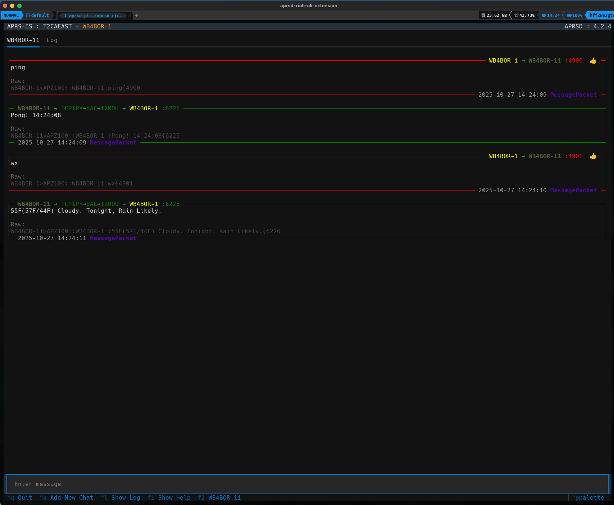

APRSD CLI UI
============

[](https://pypi.org/project/aprsd-rich-cli-extension/)
[](https://pypi.org/project/aprsd-rich-cli-extension/)
[](https://pypi.org/project/aprsd-rich-cli-extension)
[](https://opensource.org/licenses/Apache Software License 2.0)

[](https://aprsd-rich-cli-extension.readthedocs.io/)
[](https://github.com/hemna/aprsd-rich-cli-extension/actions?workflow=Tests)
[](https://codecov.io/gh/hemna/aprsd-rich-cli-extension)

[](https://github.com/pre-commit/pre-commit)

---

> [!WARNING]
> Legal operation of this software requires an amateur radio license and a valid call sign.

> [!NOTE]
> Star this repo to follow our progress! This code is under active development, and contributions are both welcomed and appreciated. See [CONTRIBUTING.md](<https://github.com/craigerl/aprsd/blob/master/CONTRIBUTING.md>) for details.

# What is APRSD Rich CLI Extension?

APRSD Rich CLI Extension provides beautiful, interactive terminal UI versions of APRSD commands using the [Textual](https://textual.textualize.io/) library. This extension transforms the traditional command-line APRS experience into a modern, user-friendly interface.

## Features

The extension provides rich terminal UIs for:

- **APRS Chat** - An interactive chat interface for sending and receiving APRS messages in real-time
- **APRS Listen** - A live packet monitor showing incoming APRS packets with detailed information
- **Packet Filtering** - Advanced filtering and search capabilities
- **Real-time Updates** - Live updates as packets are received



## Requirements

- Python >=3.10
- APRSD >=4.2.0
- Textual (installed automatically)

## Installation

You can install *APRSD CLI UI* via [pip](https://pip.pypa.io/) from [PyPI](https://pypi.org/) or using [uv](https://docs.astral.sh/uv/):

``` console
$ pip install aprsd-rich-cli-extension
```

or with uv:

``` console
$ uv pip install aprsd-rich-cli-extension
```

## Usage

Once installed, the extension adds new subcommands to the `aprsd` CLI:

- `aprsd chat` - Launch the interactive APRS chat interface
- `aprsd listen` - Launch the live APRS packet listener

You can use the built-in help to see all available options:

``` console
$ aprsd chat --help
$ aprsd listen --help
```

For more detailed usage information, please see the [Command-line Reference](https://aprsd-rich-cli-extension.readthedocs.io/en/latest/usage.html).

# Contributing

Contributions are very welcome. To learn more, see the [Contributor
Guide](CONTRIBUTING.rst).

# License

Distributed under the terms of the
[Apache Software License 2.0 license](https://opensource.org/licenses/Apache Software License 2.0), *APRSD CLI UI* is free and open source software.

# Issues

If you encounter any problems, please [file an issue](https://github.com/hemna/aprsd-rich-cli-extension/issues)
along with a detailed description.

# Credits

This project was generated from [@hemna](https://github.com/hemna)\'s
[APRSD Extension Python Cookiecutter]() template.
